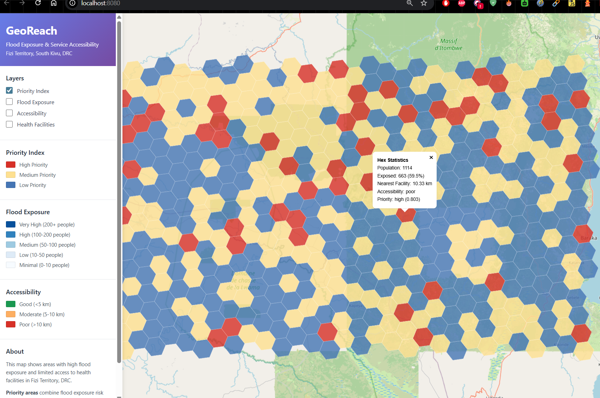
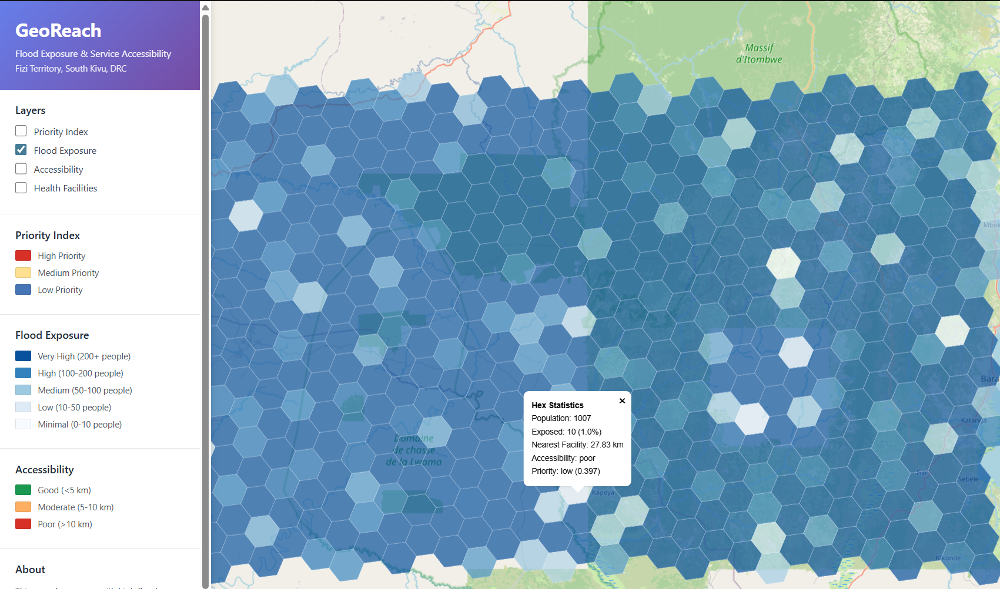
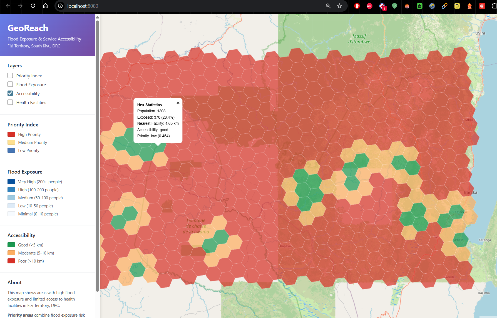
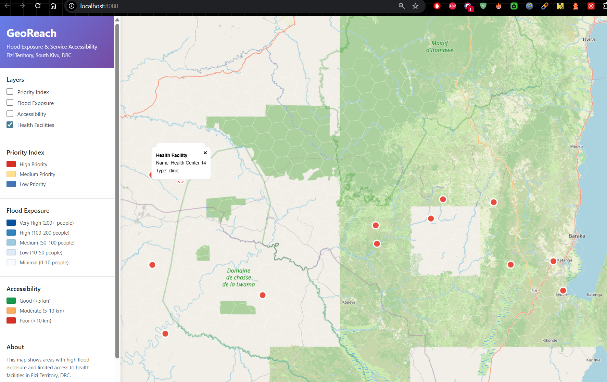
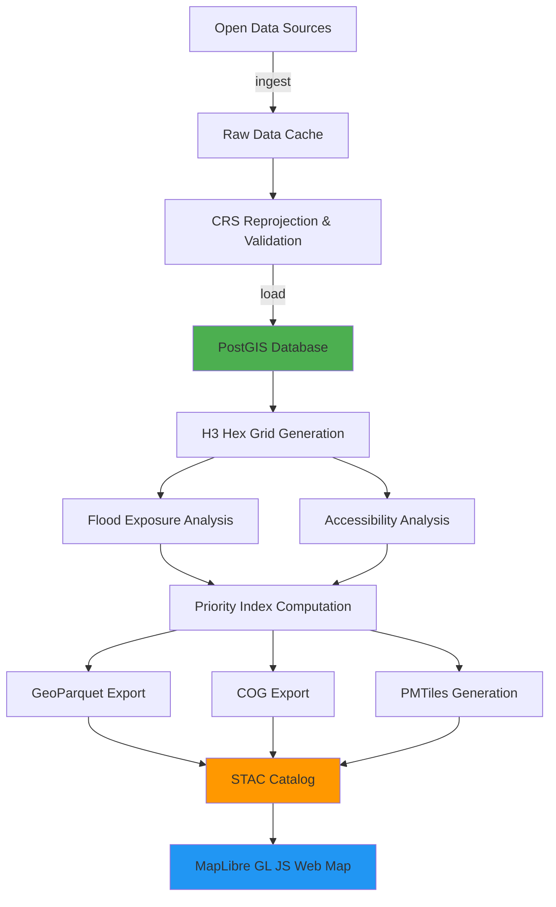

# GeoReach

**Flood-Exposure & Service-Accessibility Geospatial Platform for the Democratic Republic of the Congo**

[](https://opensource.org/licenses/MIT)
[](https://www.python.org/downloads/)
[](https://postgis.net/)
[](https://www.docker.com/)
[](https://gdal.org/)
[](https://maplibre.org/)
[](https://h3geo.org/)
[](https://github.com/psf/black)
[](https://github.com/astral-sh/ruff)

## Overview

GeoReach identifies priority intervention areas by combining **flood exposure risk** with **healthcare accessibility** in Fizi Territory, DRC. Built with PostGIS, H3 hexagonal grids, and cloud-native geospatial formats.

**Core Question:** Where are people most exposed to floods AND farthest from health facilities?

### Interactive Map Views

<table>
  <tr>
    <td align="center">
      
      <br />
      <b>Priority Index</b>
      <br />
      <em>High/Medium/Low priority areas</em>
    </td>
    <td align="center">
      
      <br />
      <b>Flood Exposure</b>
      <br />
      <em>Population exposed to flood hazard</em>
    </td>
  </tr>
  <tr>
    <td align="center">
      
      <br />
      <b>Service Accessibility</b>
      <br />
      <em>Distance to nearest health facility</em>
    </td>
    <td align="center">
      
      <br />
      <b>Health Facilities</b>
      <br />
      <em>Healthcare service locations</em>
    </td>
  </tr>
</table>

## Key Features

- **PostGIS Spatial Analysis** - GIST indexes, spatial joins, zonal statistics
- **H3 Hexagonal Grids** - Resolution 6 demo, configurable to 8 for production
- **Cloud-Native Outputs** - GeoParquet, COG, PMTiles, STAC catalog
- **Interactive Web Map** - MapLibre GL JS with layer controls and popups
- **One-Command Setup** - `docker-compose up --build`
- **Production-Ready** - Type hints, tests, CI/CD, structured logging

## Architecture



## Quick Start

```bash
docker-compose up --build
```

Open http://localhost:8080 to view the interactive map.

> Runs on bundled Fizi Territory subset with synthetic flood data (~30-40 seconds).

## Installation

**Requirements:** Python 3.11+, Docker, PostGIS 3.4, GDAL 3.8+

```bash
git clone https://github.com/JuniorDieka/georeach.git
cd georeach
pip install -r requirements.txt
pip install -e .
```

**Run Pipeline:**
```bash
make demo              # Quick demo with subset
make full              # Full Fizi Territory analysis

# Or run stages individually:
georeach ingest --subset
georeach load
georeach grid
georeach exposure
georeach accessibility
georeach priority
georeach export
```

## Data Sources

| Dataset | Source | License | Purpose |
|---------|--------|---------|---------|
| Admin Boundaries | GADM 4.1 | Free for non-commercial | Study area definition |
| Population | WorldPop 2020 | CC BY 4.0 | Population distribution |
| Buildings/Roads | Overture Maps | CDLA Permissive 2.0 | Infrastructure |
| Health Facilities | healthsites.io | ODbL | Service locations |
| Flood Hazard | **Synthetic (Demo)** | N/A | **Portfolio demo only** |

⚠️ **Note:** The flood hazard layer is synthetic data created for demonstration purposes. In production, use real flood data from GFDRR, Fathom, JRC, or similar authoritative sources.

See [DATA_SOURCES.md](docs/design/DATA_SOURCES.md) for detailed provenance and licenses.

## Methodology

**Study Area:** Fizi Territory, South Kivu, DRC (27.3-29.1°E, -4.5 to -3.5°S, ~4,000 km²)

**Analysis Pipeline:**

1. **H3 Grid Generation** - Resolution 6 hexagons (~36 km² each, 529 hexes for demo)
2. **Flood Exposure** - Zonal stats: population within flood zones per hex
3. **Accessibility** - Euclidean distance to nearest health facility
4. **Priority Index** - Composite score: `(exposure × 0.6) + (inaccessibility × 0.4)`

**CRS:** EPSG:32735 (UTM 35S) for analysis, EPSG:4326 (WGS 84) for outputs

> See [ARCHITECTURE.md](docs/design/ARCHITECTURE.md) for design decisions (why H3, why Euclidean distance, CRS rationale)

## Configuration

**Key settings in `config.yaml`:**
- H3 resolution (6 for demo, 8 for production)
- Priority weights (default: 60% exposure, 40% accessibility)
- Accessibility thresholds (5km good, 10km moderate)
- Study area bounding box

## Project Structure

```
georeach/
├── georeach/          # Python package (ingest, analysis, export)
├── sql/               # PostGIS schema
├── frontend/          # MapLibre web map
├── tests/             # Pytest suite
├── data/outputs/      # GeoParquet, COG, STAC, GeoJSON
└── config.yaml        # Analysis configuration
```

## Outputs

**Cloud-native formats in `data/outputs/`:**
- GeoParquet (h3_results, admin_results)
- Cloud-Optimized GeoTIFF (population, flood hazard)
- GeoJSON (h3_grid, health_facilities)
- STAC catalog (catalog.json)

## Development

```bash
pip install -e ".[dev]"   # Install dev dependencies
make test                  # Run tests with coverage
make lint                  # Ruff + mypy
make format                # Black formatting
```

**CI/CD:** GitHub Actions runs linting, tests, and coverage on every push.

## Performance

| Mode | Hexagons | Population | Exposed | Runtime |
|------|----------|------------|---------|----------|
| **Demo** (res 6) | 529 | 478k | 148k (31%) | 30-40s |
| **Full** (res 8) | ~5,400 | ~1.2M | ~350k (29%) | 5-10min |

## Limitations

- **Flood data:** Synthetic (demo only) - use GFDRR/Fathom/JRC for production
- **Accessibility:** Euclidean distance - pgRouting recommended for road networks
- **Temporal:** Static snapshot - add seasonal/multi-temporal analysis
- **Scale:** Single territory - optimize with Dask for regional analysis

## Documentation

- **[Architecture & Design Decisions](docs/design/ARCHITECTURE.md)** - Technical choices, CRS selection, H3 rationale, accessibility approach
- **[Data Sources](docs/design/DATA_SOURCES.md)** - Detailed provenance, licenses, and recommendations
- **[Contributing Guide](CONTRIBUTING.md)** - Development setup, code standards, testing
- **[Push Checklist](docs/PUSH_CHECKLIST.md)** - Pre-deployment checklist (for maintainers)

## Contributing

See [CONTRIBUTING.md](CONTRIBUTING.md) for guidelines.

## License

MIT License - see [LICENSE](LICENSE) for details.

## Citation

If you use this project, please cite:

```bibtex
@software{georeach2026,
  title = {GeoReach: Flood-Exposure and Service-Accessibility Geospatial Platform},
  author = {Junior Dieka},
  year = {2026},
  url = {https://github.com/JuniorDieka/georeach}
}
```

## Acknowledgments

- **Data Providers:** GADM, WorldPop, Overture Maps, healthsites.io
- **Tools:** PostGIS, GDAL, H3, MapLibre GL JS, DuckDB
- **Inspiration:** Humanitarian GIS workflows from OCHA, UNHCR, UNICEF, WFP, AFRICA CDC and UNDRR

## Contact

For questions or collaboration: [GitHub Issues](https://github.com/JuniorDieka/georeach/issues)

---

**Built with ❤️ for humanitarian geospatial analysis**
