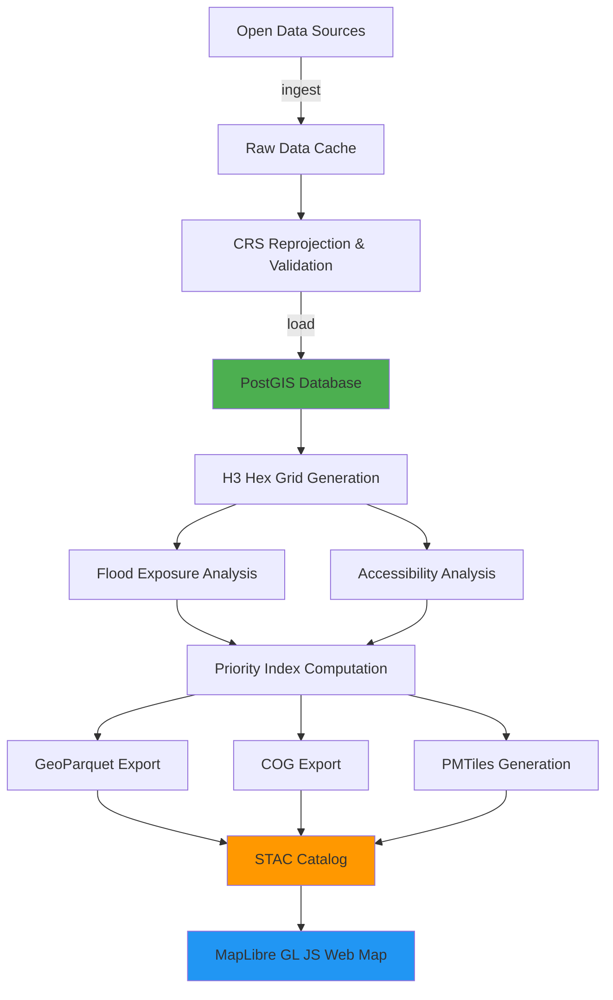

# GeoReach

**Flood-Exposure & Service-Accessibility Geospatial Platform for the Democratic Republic of the Congo**

[](https://opensource.org/licenses/MIT)
[](https://www.python.org/downloads/)
[](https://postgis.net/)
[](https://www.docker.com/)
[](https://gdal.org/)
[](https://maplibre.org/)
[](https://h3geo.org/)
[](https://github.com/psf/black)
[](https://github.com/astral-sh/ruff)

## Overview

GeoReach is a production-grade geospatial analysis platform that identifies priority intervention areas by combining flood exposure risk with healthcare accessibility in Fizi Territory, South Kivu Province, DRC. The platform demonstrates modern GIS engineering practices with PostGIS spatial analysis, cloud-native data formats, and an interactive web map.

**Key Question:** Which populated areas are both most exposed to flood hazard AND least able to reach a health facility — i.e., where should interventions be prioritized?

### Interactive Map Views

<table>
  <tr>
    <td align="center">
      
      <br />
      <b>Priority Index</b>
      <br />
      <em>High/Medium/Low priority areas</em>
    </td>
    <td align="center">
      
      <br />
      <b>Flood Exposure</b>
      <br />
      <em>Population exposed to flood hazard</em>
    </td>
  </tr>
  <tr>
    <td align="center">
      
      <br />
      <b>Service Accessibility</b>
      <br />
      <em>Distance to nearest health facility</em>
    </td>
    <td align="center">
      
      <br />
      <b>Health Facilities</b>
      <br />
      <em>Healthcare service locations</em>
    </td>
  </tr>
</table>

## What This Demonstrates

This portfolio project showcases real geospatial engineering capabilities:

- ✅ **PostGIS + Spatial SQL**: Complex spatial queries, GIST indexes, spatial joins, and aggregations
- ✅ **Raster × Vector Analysis**: Zonal statistics combining population rasters with flood hazard layers
- ✅ **Network/Distance Accessibility**: Distance-based accessibility analysis to health facilities
- ✅ **H3 Hexagonal Grid**: Discrete global grid system for spatial aggregation at resolution 6 (demo mode)
- ✅ **Cloud-Native Outputs**: GeoParquet, Cloud-Optimized GeoTIFF (COG), PMTiles, STAC catalog
- ✅ **Interactive Web Map**: MapLibre GL JS with vector tiles, layer controls, and popups
- ✅ **Reproducible Pipeline**: One-command Docker setup with staged ETL and full test coverage
- ✅ **Production Practices**: Type hints, tests, CI/CD, linting, structured logging, CRS discipline

## Architecture



## Quick Start (Demo)

**One command to run the entire pipeline and view the interactive map:**

```bash
docker-compose up --build
```

Then open http://localhost:8080 in your browser.

This runs the full pipeline on a bundled subset of Fizi Territory with synthetic demo data.

## Manual Setup

### Prerequisites

- Python 3.11+
- Docker & Docker Compose
- PostgreSQL 16 + PostGIS 3.4
- GDAL 3.8+
- (Optional) tippecanoe for PMTiles generation

### Installation

```bash
# Clone repository
git clone https://github.com/JuniorDieka/georeach.git
cd georeach

# Install dependencies
pip install -r requirements.txt
pip install -e .

# Set up environment
cp .env.example .env

# Start PostGIS
docker-compose up -d postgis
```

### Run Pipeline

```bash
# Quick demo with subset data
make demo

# Or run stages individually
georeach ingest --subset
georeach load
georeach grid
georeach exposure
georeach accessibility
georeach priority
georeach export
georeach tiles

# Full pipeline with complete data
make full
```

## Data Sources

| Dataset | Source | License | Purpose |
|---------|--------|---------|---------|
| Admin Boundaries | GADM 4.1 | Free for non-commercial | Study area definition |
| Population | WorldPop 2020 | CC BY 4.0 | Population distribution |
| Buildings/Roads | Overture Maps | CDLA Permissive 2.0 | Infrastructure |
| Health Facilities | healthsites.io | ODbL | Service locations |
| Flood Hazard | **Synthetic (Demo)** | N/A | **Portfolio demo only** |

⚠️ **Note:** The flood hazard layer is synthetic data created for demonstration purposes. In production, use real flood data from GFDRR, Fathom, JRC, or similar authoritative sources.

See [DATA_SOURCES.md](DATA_SOURCES.md) for detailed provenance and licenses.

## Methodology

### Study Area
- **Location:** Fizi Territory, South Kivu Province, DRC
- **Bounding Box:** 27.3°E to 29.1°E, -4.5°S to -3.5°S
- **Area:** ~4,000 km²

### Coordinate Reference Systems
- **Analysis CRS:** EPSG:32735 (WGS 84 / UTM zone 35S) — for metric distance/area calculations
- **Storage/Display CRS:** EPSG:4326 (WGS 84) — for web mapping and interoperability

### H3 Grid
- **Resolution:** 6 (average hex edge ~3.23 km, area ~36.13 km²) for demo mode
- **Coverage:** ~529 hexagons for Fizi Territory subset
- **Rationale:** Balances performance with meaningful spatial aggregation for demo purposes
- **Production:** Can be configured to resolution 8 (~461m edge) for finer-grained analysis

### Flood Exposure Analysis
1. Load WorldPop population raster (1km resolution)
2. Load flood hazard depth/extent raster
3. Compute zonal statistics: sum population within flood zones per H3 hex
4. Output: exposed population count + percentage per hex

**Formula:**
```
exposure_pct = (population_exposed / total_population) × 100
```

### Service Accessibility Analysis
1. Load health facility point locations
2. For each populated hex centroid, compute Euclidean distance to nearest facility
3. Classify accessibility:
   - **Good:** < 5 km
   - **Moderate:** 5-10 km
   - **Poor:** > 10 km
4. Compute accessibility score (0-1, higher = better access)

**Future Enhancement:** Implement network-based routing with pgRouting over road network for travel-time accessibility.

### Priority Index
Normalized composite score combining exposure and inaccessibility:

```
priority_score = (norm_exposure × 0.6) + (norm_inaccessibility × 0.4)
```

- **Weights:** Configurable in `config.yaml` (default: 60% exposure, 40% accessibility)
- **Normalization:** Min-max scaling to [0, 1]
- **Classification:** Top 10% flagged as high-priority intervention zones

## Configuration

Edit `config.yaml` to customize:

```yaml
study_area:
  bbox: {west: 27.3, south: -4.5, east: 29.1, north: -3.5}

h3:
  resolution: 6  # Use 8 for production, 6 for demo

analysis:
  accessibility:
    threshold_km: 5.0
    moderate_km: 10.0
  priority:
    exposure_weight: 0.6
    accessibility_weight: 0.4
    top_percentile: 10
```

## Project Structure

```
georeach/
├── georeach/              # Main Python package
│   ├── ingest/            # Data ingestion modules
│   ├── db/                # PostGIS database utilities
│   ├── grid/              # H3 grid generation
│   ├── analysis/          # Exposure, accessibility, priority
│   ├── export/            # GeoParquet, COG, STAC
│   └── tiles/             # PMTiles generation
├── sql/                   # PostGIS schema and queries
├── frontend/              # MapLibre GL JS web map
├── tests/                 # Pytest test suite
├── docker/                # Dockerfiles
├── data/
│   ├── raw/               # Downloaded source data
│   ├── processed/         # Intermediate outputs
│   ├── subset/            # Bundled demo data
│   └── outputs/           # Final exports
├── config.yaml            # Configuration
├── docker-compose.yml     # Docker orchestration
├── Makefile               # Build automation
└── pyproject.toml         # Python package metadata
```

## Outputs

All outputs are in `data/outputs/`:

- **h3_results.parquet** — H3 grid with all analysis results (GeoParquet)
- **admin_results.parquet** — Admin boundaries with aggregated stats (GeoParquet)
- **population_cog.tif** — Population raster (Cloud-Optimized GeoTIFF)
- **flood_hazard_cog.tif** — Flood hazard raster (COG)
- **h3_grid.geojson** — H3 grid vector data (GeoJSON fallback)
- **health_facilities.geojson** — Facility points vector data (GeoJSON)
- **catalog.json** — STAC catalog describing all assets

## Testing

```bash
# Run all tests
make test

# Run with coverage
pytest tests/ -v --cov=georeach --cov-report=html

# Run specific test module
pytest tests/test_exposure.py -v
```

## Development

```bash
# Install dev dependencies
pip install -e ".[dev]"

# Set up pre-commit hooks
pre-commit install

# Format code
make format

# Lint code
make lint

# Type check
mypy georeach/
```

## CI/CD

GitHub Actions workflow runs on every push:
- Linting (ruff, black, mypy)
- Tests with PostGIS service container
- Coverage reporting

## Performance

**Demo pipeline (subset, H3 resolution 6):**
- 529 hexagons
- 15 health facilities
- Total population: 478,003
- Exposed population: 147,995 (31%)
- High priority areas: 53 hexagons (12.5% of population)
- Runtime: ~30-40 seconds (excluding Docker build)

**Full pipeline (Fizi Territory, H3 resolution 8):**
- ~5,400 hexagons
- ~15-20 health facilities
- Runtime: ~5-10 minutes (depending on data download and processing)

## Limitations & Future Work

1. **Flood Data:** Currently uses synthetic demo data. Replace with real flood models (GFDRR, Fathom, JRC).
2. **Accessibility:** Euclidean distance only. Implement pgRouting for network-based travel time.
3. **Temporal Analysis:** Static snapshot. Add multi-temporal flood scenarios and seasonal accessibility.
4. **Validation:** Ground-truth validation with field surveys or local knowledge.
5. **Scalability:** Optimize for country-wide or regional analysis with Dask/parallel processing.

## Contributing

See [CONTRIBUTING.md](CONTRIBUTING.md) for guidelines.

## License

MIT License - see [LICENSE](LICENSE) for details.

## Citation

If you use this project, please cite:

```bibtex
@software{georeach2026,
  title = {GeoReach: Flood-Exposure and Service-Accessibility Geospatial Platform},
  author = {Junior Dieka},
  year = {2026},
  url = {https://github.com/JuniorDieka/georeach}
}
```

## Acknowledgments

- **Data Providers:** GADM, WorldPop, Overture Maps, healthsites.io
- **Tools:** PostGIS, GDAL, H3, MapLibre GL JS, DuckDB
- **Inspiration:** Humanitarian GIS workflows from OCHA, UNHCR, UNICEF, WFP, AFRICA CDC and UNDRR

## Contact

For questions or collaboration: [GitHub Issues](https://github.com/JuniorDieka/georeach/issues)

---

**Built with ❤️ for humanitarian geospatial analysis**
